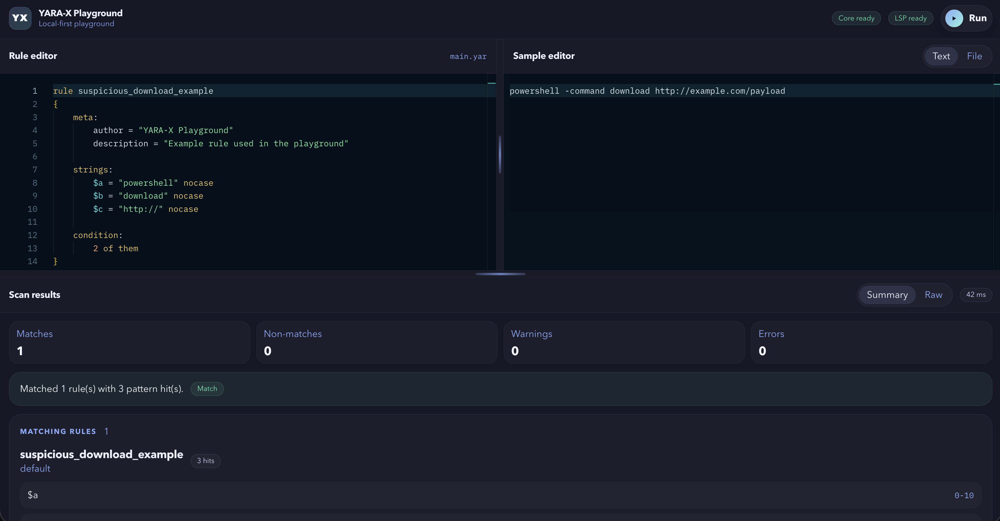

# YARA-X Playground

Write, format, and run YARA rules directly in the browser using WebAssembly.

A playground that combines [YARA-X](https://github.com/VirusTotal/yara-x), the Rust implementation of YARA, with Monaco Editor and the YARA language server so you can experiment with rules instantly without installing anything.



## What you get

- YARA rule editing with Monaco
- syntax highlighting
- language-server features:
  - diagnostics
  - autocompletion
  - hover information
  - go to definition
  - formatting
- sample input as plain text or local file
- rule execution powered by a WebAssembly build of YARA-X
- everything running entirely inside the browser

### Shortcuts

- `Cmd/Ctrl + S` format the current rule
- `Cmd/Ctrl + Shift + F` format the current rule
- `Cmd/Ctrl + Space` trigger autocompletion
- `Cmd/Ctrl + Enter` run the current rule against the current sample

## Quick start

```bash
npm install
npm run dev
```

Build for production:

```bash
npm run build
```

## How it works

The playground uses two WebAssembly builds from the YARA-X repository:

- **engine** (`public/wasm-poc/`) — the YARA-X compiler and scanner, compiled to WASM.
- **language server** (`public/wasm-ls/`) — the official YARA-X LS running in a Web Worker,
  communicating with Monaco via the Language Server Protocol.

The WASM artifacts were built locally from the yara-x source and include small adjustments
to the JavaScript glue code to make the browser flow work correctly. A CI action to rebuild
them automatically from upstream would be a next step.

Both are checked into the repo so the playground works out of the box without a build step.

### Privacy

No analytics, no tracking, no telemetry, no external requests.  
Files you load stay in memory for the duration of the session and go nowhere.

### Built with

- [YARA-X](https://github.com/VirusTotal/yara-x) — Rust · WebAssembly
- [YARA-X Language Server](https://virustotal.github.io/yara-x/blog/introducing-the-yara-language-server/)
- [Monaco Editor](https://microsoft.github.io/monaco-editor/)
- [Lit](https://lit.dev/)
- [Vite](https://vitejs.dev/)

### License

MIT
